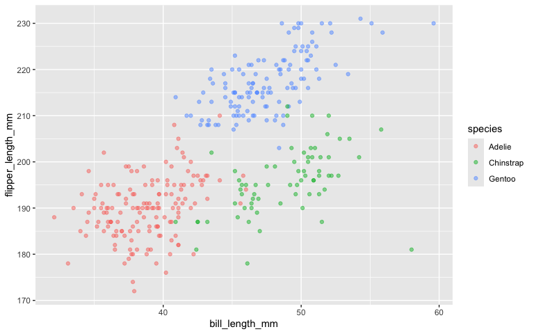

p8105_hw1_yl5839
================
Yuying Lu
2024-09-15

# Problem 1

**Data Importing**

``` r
data("penguins",package="palmerpenguins")
penguins
```

    ## # A tibble: 344 × 8
    ##    species island    bill_length_mm bill_depth_mm flipper_length_mm body_mass_g
    ##    <fct>   <fct>              <dbl>         <dbl>             <int>       <int>
    ##  1 Adelie  Torgersen           39.1          18.7               181        3750
    ##  2 Adelie  Torgersen           39.5          17.4               186        3800
    ##  3 Adelie  Torgersen           40.3          18                 195        3250
    ##  4 Adelie  Torgersen           NA            NA                  NA          NA
    ##  5 Adelie  Torgersen           36.7          19.3               193        3450
    ##  6 Adelie  Torgersen           39.3          20.6               190        3650
    ##  7 Adelie  Torgersen           38.9          17.8               181        3625
    ##  8 Adelie  Torgersen           39.2          19.6               195        4675
    ##  9 Adelie  Torgersen           34.1          18.1               193        3475
    ## 10 Adelie  Torgersen           42            20.2               190        4250
    ## # ℹ 334 more rows
    ## # ℹ 2 more variables: sex <fct>, year <int>

``` r
summary(penguins)
```

    ##       species          island    bill_length_mm  bill_depth_mm  
    ##  Adelie   :152   Biscoe   :168   Min.   :32.10   Min.   :13.10  
    ##  Chinstrap: 68   Dream    :124   1st Qu.:39.23   1st Qu.:15.60  
    ##  Gentoo   :124   Torgersen: 52   Median :44.45   Median :17.30  
    ##                                  Mean   :43.92   Mean   :17.15  
    ##                                  3rd Qu.:48.50   3rd Qu.:18.70  
    ##                                  Max.   :59.60   Max.   :21.50  
    ##                                  NA's   :2       NA's   :2      
    ##  flipper_length_mm  body_mass_g       sex           year     
    ##  Min.   :172.0     Min.   :2700   female:165   Min.   :2007  
    ##  1st Qu.:190.0     1st Qu.:3550   male  :168   1st Qu.:2007  
    ##  Median :197.0     Median :4050   NA's  : 11   Median :2008  
    ##  Mean   :200.9     Mean   :4202                Mean   :2008  
    ##  3rd Qu.:213.0     3rd Qu.:4750                3rd Qu.:2009  
    ##  Max.   :231.0     Max.   :6300                Max.   :2009  
    ##  NA's   :2         NA's   :2

**Description**

The `penguins` dataset has 344 rows and each row vector includes the
information of a collected penguin sample. Meanwhile, there are 8
columns in the dataset, representing different characteristics of the
penguins. The columns are species, island, bill_length_mm,
bill_depth_mm, flipper_length_mm, body_mass_g, sex, year\`, which
respectively refer to the species, island, bill length, bill depth,
flipper length, body mass sex and the study year of each collected
sample.

The study years of these samples are 2007, 2008, 2009. There are three
species penguins (Adelie, Gentoo, Chinstrap) included in this dataset
and they come from three islands (Torgersen, Biscoe, Dream).

Regardless of some missing data, the dataset contains 165 female
penguins and 168 male penguins. The mean values of other four variables
are listed as below:

| bill length(mm) | bill depth(mm) | flipper length(mm) | body mass(g) |
|:---------------:|:--------------:|:------------------:|:------------:|
|      43.92      |     17.15      |       200.92       |   4201.75    |

``` r
# load a necessary package
library(tidyverse)
# scatterplot for flipper_length vs bill_length
ggplot(penguins,aes(x=bill_length_mm,y=flipper_length_mm,color=species))+
  geom_point(alpha=.5)
```

<!-- -->

``` r
# save the plot
ggsave('flipper_length_vs_bill_length.png')
```

# Problem 2

``` r
set.seed(111)
df<-tibble(vec_sample=rnorm(10),
           vec_logic=vec_sample>0,
           vec_char=c('A','B','C','E','F','11','12','D','133','S'),
           vec_factor=factor(c('black','white','red','red','black','black','white','red','white','white'),levels=c('black','white','red')))
df
```

    ## # A tibble: 10 × 4
    ##    vec_sample vec_logic vec_char vec_factor
    ##         <dbl> <lgl>     <chr>    <fct>     
    ##  1      0.235 TRUE      A        black     
    ##  2     -0.331 FALSE     B        white     
    ##  3     -0.312 FALSE     C        red       
    ##  4     -2.30  FALSE     E        red       
    ##  5     -0.171 FALSE     F        black     
    ##  6      0.140 TRUE      11       black     
    ##  7     -1.50  FALSE     12       white     
    ##  8     -1.01  FALSE     D        red       
    ##  9     -0.948 FALSE     133      white     
    ## 10     -0.494 FALSE     S        white

**Try to Take the Mean**

- The mean of `vec_sample` is -0.6690135;
- The mean of `vec_logic` is 0.2;
- The mean of `vec_char` is NA;
- The mean of `vec_factor` is NA;

As shown above, the function `mean()` works on the numeric variable
`vec_sample` and the logical variable `vec_logic`. However, it doesn’t
work on the character variable `vec_char` and factor variable
`vec_factor`.

**Try Function `as.numeric`**

When I try `as.numeric()` function to the logical, character, and factor
variables using the following code:

``` r
as.numeric(pull(df,vec_logic))
as.numeric(pull(df,vec_char))
as.numeric(pull(df,vec_factor))
```

- For logical variable, it converts ‘TRUE’ to 1 and converts ‘FALSE’ to
  0;
- For character variable, it turns a non-numeric character like ‘A’ to
  NA and turns a numeric character like ‘12’ to the number itself;
- For factor variable, it returns the integer inherited the priority of
  the factor levels. In our example, the integer be assigned to
  ‘black’,‘white’ and ‘red’, are 1,2 3 respectively, because the level
  of factor is ‘black’,‘white’, ‘red’.

There is a possible explanation for the results of applying `mean()` to
these three types of variables. When I apply function `mean()` to a
logical, it will automatically regard the logical variable `vec_logic`
as the numeric number `as.numeric(vec_logic)`. However, when applying
function `mean()` to the character variable or the factor variable, it
can’t actually turn them to a numeric number. Therefore, it results to
NA when taking the mean of character variable or the factor variable
using `mean()`.
